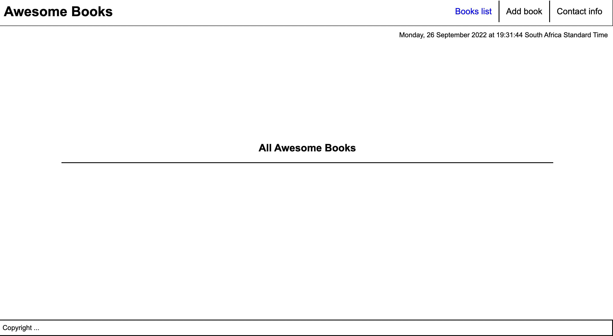

# ES6 Booklist Project

- In this project I will build a basic website that allows users to add/remove books from a list.
- I wanted to understand the different ways to create objects in JavaScript, and how to access properties and methods of JavaScript objects.

## built with

- best practices in HTML code
- CSS selectors correctly
- JavaScript objects and arrays
- dynamically modify the DOM and add basic events
- ES6 syntax
- modules

## Live Demo

# WORK FLOW SCREENSHOTS

## Prerequisites

- computer with internet
- visual studio code

## Author

- GitHub: [@githubhandle](https://github.com/MohamedHNoor)
- Twitter: [@twitterhandle](https://twitter.com/MohamedHNoor)
- LinkedIn: [@linkedinhandle](https://www.linkedin.com/in/mohamedhnoor/)

## 🤝 Contributing

Contributions, issues, and feature requests are welcome!

Feel free to check the issues page.

## Show your support

Give a ⭐️ if you like this project!

## Acknowledgments

## 📝 License

This project is [MIT](MIT.md) licensed.

_NOTE: we recommend using the [MIT license](https://choosealicense.com/licenses/mit/) - you can set it up quickly by [using templates available on GitHub](https://docs.github.com/en/communities/setting-up-your-project-for-healthy-contributions/adding-a-license-to-a-repository). You can also use [any other license](https://choosealicense.com/licenses/) if you wish._
